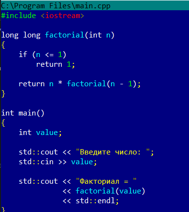
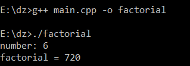
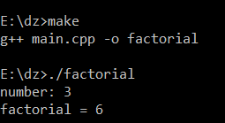
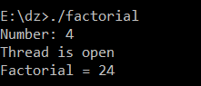
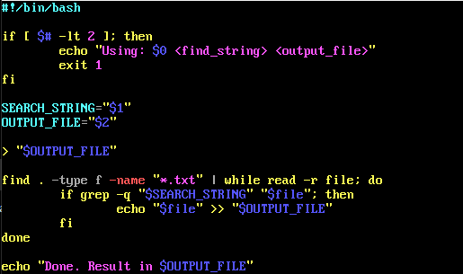
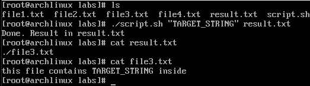
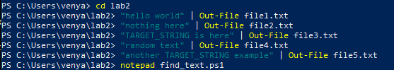
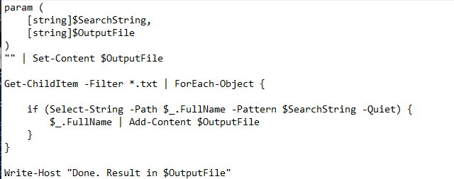
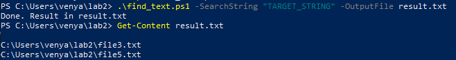

# Лабораторная работа №1
## Исследование компилятора GCC и анализ ассемблерного кода

---

# 1. Создание программы на C++

## Исходный файл программы

Создаем файл `main.cpp` и добавляем в него код программы для вычисления факториала числа.

```cpp
#include <iostream>

long long factorial(int n)
{
    if (n <= 1)
        return 1;

    return n * factorial(n - 1);
}

int main()
{
    int value;

    std::cout << "number: ";
    std::cin >> value;

    std::cout << "factorial = "
              << factorial(value)
              << std::endl;
}
```

### Скриншот исходного кода:


---

## Компиляция и запуск программы

Для компиляции программы используется команда:

```bash
g++ main.cpp -o factorial
```

Запуск программы:

```bash
./factorial
```

### Результат компиляции и запуска:


---

# 2. Генерация ассемблерного кода

## Компиляция без оптимизации (-O0)

Создаем ассемблерный файл без оптимизации:

```bash
g++ -O0 -S main.cpp -o main_O0.s
```

### Ассемблерный код без оптимизации:
```
.file	"main.cpp"
.text

.globl	_Z9factoriali
_Z9factoriali:

# --- Пролог функции ---
pushq	%rbp
pushq	%rbx
subq	$40, %rsp

# Сохранение аргумента n
movl	%ecx, 32(%rbp)

# Проверка n <= 1
cmpl	$1, 32(%rbp)
jg	.Lrec

# База рекурсии
movl	$1, %eax
addq	$40, %rsp
popq	%rbx
popq	%rbp
ret

.Lrec:
# Сохраняем n
movl	32(%rbp), %eax
movslq	%eax, %rbx

# Вычисляем n - 1
movl	32(%rbp), %eax
subl	$1, %eax
movl	%eax, %ecx

# Рекурсивный вызов factorial(n - 1)
call	_Z9factoriali

# Умножение результата на n
imulq	%rbx, %rax

# --- Эпилог ---
addq	$40, %rsp
popq	%rbx
popq	%rbp
ret

.globl	main
main:

# Инициализация и стек
pushq	%rbx
subq	$56, %rsp

call	__main

# Вывод "number: "
lea	.LC0(%rip), %rdx
movq	.refptr._ZSt4cout(%rip), %rcx
call	_ZStlsISt11char_traitsIcEERSt13basic_ostreamIcT_ES5_PKc

# Ввод числа
movq	.refptr._ZSt3cin(%rip), %rcx
lea	-4(%rbp), %rdx
call	_ZNSirsERi

# Вывод "factorial = "
lea	.LC1(%rip), %rdx
movq	.refptr._ZSt4cout(%rip), %rcx
call	_ZStlsISt11char_traitsIcEERSt13basic_ostreamIcT_ES5_PKc

# Сохраняем поток вывода
movq	%rax, %rbx

# factorial(n)
movl	-4(%rbp), %eax
movl	%eax, %ecx
call	_Z9factoriali

# Вывод результата
movq	%rax, %rdx
movq	%rbx, %rcx
call	_ZNSolsEx

# endl
movq	.refptr._ZSt4endlIcSt11char_traitsIcEERSt13basic_ostreamIT_T0_ES6_(%rip), %rdx
call	_ZNSolsEPFRSoS_E

# return 0
movl	$0, %eax

addq	$56, %rsp
popq	%rbx
ret
```

В данной версии присутствует большое количество дополнительных инструкций, связанных с организацией стека и вызовами функций.

---

## Компиляция с оптимизацией (-O2)

Создаем оптимизированную версию ассемблерного кода:

```bash
g++ -O2 -S main.cpp -o main_O2.s
```

### Ассемблерный код с оптимизацией:
```
	.file	"main.cpp"
.text

.globl	_Z9factoriali
_Z9factoriali:

# Оптимизированная версия factorial (цикл вместо рекурсии)
movl	%edi, %eax

cmpl	$1, %edi
jle	.Lbase

movl	$1, %edx

.Lloop:
imulq	%edi, %rdx
subl	$1, %edi
cmpl	$1, %edi
jg	.Lloop

movq	%rdx, %rax
ret

.Lbase:
movl	$1, %eax
ret
.globl	main
main:

call	__main

# вывод строки
lea	.LC0(%rip), %rdx
movq	.refptr._ZSt4cout(%rip), %rcx
call	_ZStlsISt11char_traitsIcEERSt13basic_ostreamIcT_ES5_PKc

# ввод числа
movq	.refptr._ZSt3cin(%rip), %rcx
lea	-4(%rbp), %rdx
call	_ZNSirsERi

# строка factorial =
lea	.LC1(%rip), %rdx
movq	.refptr._ZSt4cout(%rip), %rcx
call	_ZStlsISt11char_traitsIcEERSt13basic_ostreamIcT_ES5_PKc

# вызов factorial
movl	-4(%rbp), %eax
movl	%eax, %edi
call	_Z9factoriali

# вывод результата
movq	%rax, %rsi
movq	.refptr._ZSt4cout(%rip), %rdi
call	_ZNSolsEy

xor     %eax, %eax
ret
```

После оптимизации структура программы изменилась. 
Компилятор заменил часть рекурсивных вызовов более эффективными инструкциями и циклами, что повысило производительность программы.
---

# 3. Создание Makefile

Создаем файл `Makefile` для автоматической сборки проекта.

```Makefile
all:
	g++ main.cpp -o factorial

optimized:
	g++ -O2 main.cpp -o factorial_opt

clean:
	del factorial.exe factorial_opt.exe
```
## Выполнение сборки
Запускаем команду:

```bash
make
```

### Результат выполнения make:


---

# 4. Улучшение программы

## Добавление многопоточности

Для повышения производительности в программу была добавлена поддержка потоков.

Пример использования потоков:

```cpp
#include <iostream>
#include <thread>

long long factorial(int n)
{
    if (n <= 1)
        return 1;

    return n * factorial(n - 1);
}

void task()
{
    std::cout << "Thread is open" << std::endl;
}

int main()
{
    int number;

    std::cout << "Number: ";
    std::cin >> number;

    std::thread t(task);

    t.join();

    std::cout << "Factorial = "
              << factorial(number)
              << std::endl;

    return 0;
}
```


---

## Обновленный Makefile

После добавления потоков файл Makefile был изменен.

### Новый Makefile:
```
all:
	g++ main.cpp -o factorial -pthread

optimized:
	g++ -O2 main.cpp -o factorial_opt -pthread

clean:
	del factorial.exe factorial_opt.exe
```
---

# Вывод

В ходе выполнения лабораторной работы была изучена работа компилятора GCC. Была создана программа на языке C++, выполнена генерация ассемблерного кода с различными уровнями оптимизации, а также настроена автоматическая сборка проекта с помощью Makefile. Дополнительно была рассмотрена работа многопоточности в C++.


# Лабораторная работа №3(А). Вариант 4. В текстовых файлах (. t x t ) найти заданную в параметре сценария строку, из найденных файлов составить список, сохранить его в файл.






# Лабораторная работа №3(Б). Вариант 4.









